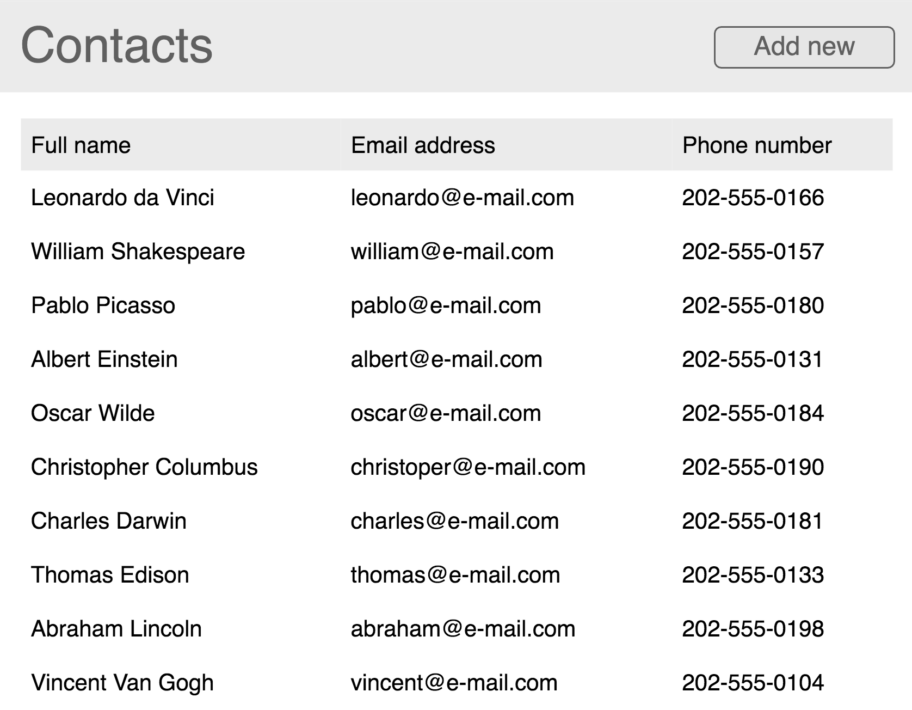
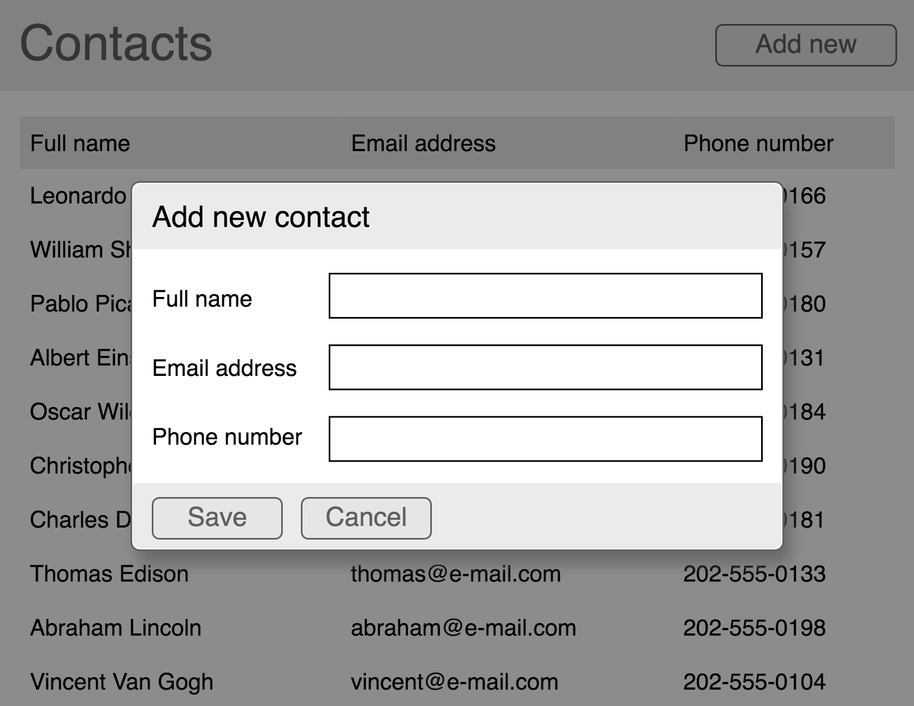

# Front-end interview homework

Main objective of this homework is to create the front-end for a simple personal contacts manager. The app should be built using JavaScript/TypeScript, CSS/Sass/etc. and HTML and should run entirely in users' browsers.

The app should include a list view **listing all available contacts**:

Additionally users should be able to **create new contacts** by clicking on "Add new" button and filling out the form which opens in a **modal window**:

Users should also be able to **edit contact's information** by clicking on the contact's row in the list. Clicking on a contact should open the edit form in a modal window similar to the one used for creating new contacts. 

Upon creating new contacts or editing existing contacts the changes should persist for as long as the user doesn't reload the page. **Implementing the back-end is not required** - use the following data to mock server response for initial contacts list request:

    [
        {"name": "Leonardo da Vinci", "email": "leonardo@e-mail.com", "phoneNumber": "202-555-0166"},
        {"name": "William Shakespeare", "email": "william@e-mail.com", "phoneNumber": "202-555-0157"},
        {"name": "Pablo Picasso", "email": "pablo@e-mail.com", "phoneNumber": "202-555-0180"},
        {"name": "Albert Einstein", "email": "albert@e-mail.com", "phoneNumber": "202-555-0131"},
        {"name": "Oscar Wilde", "email": "oscar@e-mail.com", "phoneNumber": "202-555-0184"},
        {"name": "Christopher Columbus", "email": "christoper@e-mail.com", "phoneNumber": "202-555-0190"},
        {"name": "Charles Darwin", "email": "charles@e-mail.com", "phoneNumber": "202-555-0181"},
        {"name": "Thomas Edison", "email": "thomas@e-mail.com", "phoneNumber": "202-555-0133"},
        {"name": "Abraham Lincoln", "email": "abraham@e-mail.com", "phoneNumber": "202-555-0198"},
        {"name": "Vincent Van Gogh", "email": "vincent@e-mail.com", "phoneNumber": "202-555-0104"}
    ]

**Please make sure the code you write is clean and follows what you consider to be best practices in front-end development (architecture of components, CSS styles etc.). Final solution should be something you wouldn't mind putting in production.**

## **FAQ**

- Is usage of frameworks/libraries allowed? Sure, use what you are most comfortable with.
- What browsers need to be supported? Latest version of Chrome is enough.
- Does my solution need to match the images pixel for pixel? No, in fact some creativity is very welcome.
